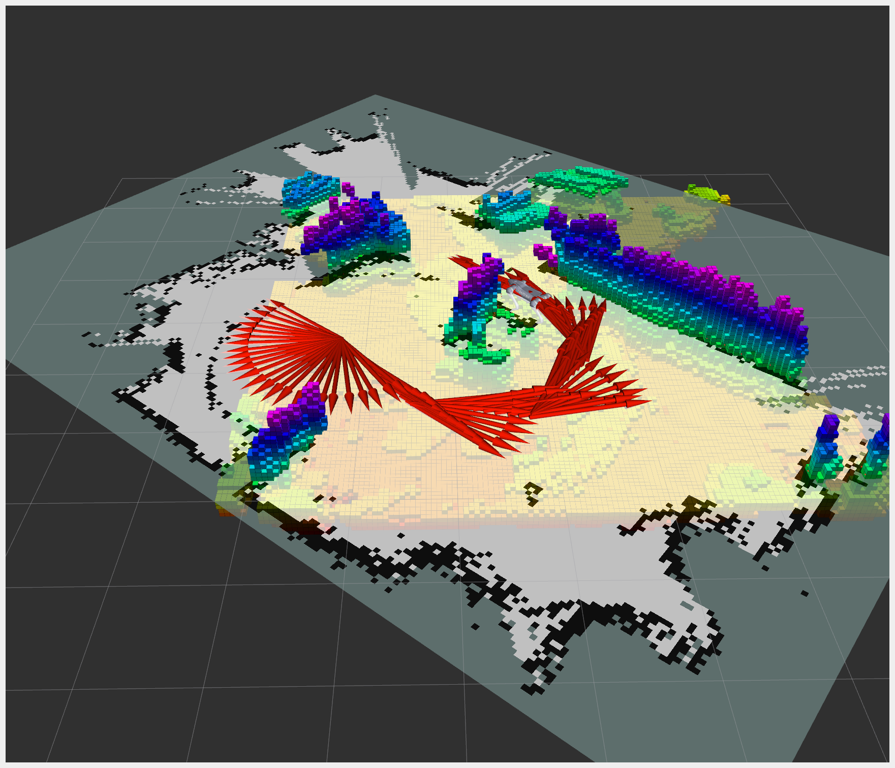
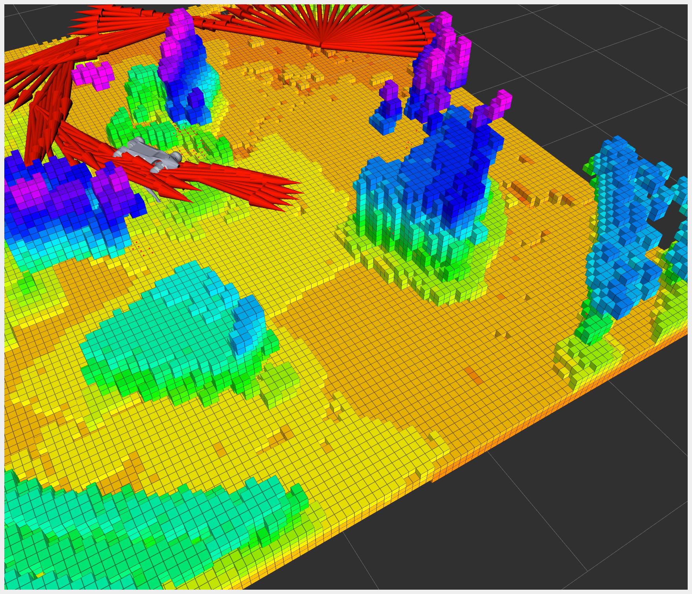

# 欢迎来到 Unitree Go2 ROS2 SDK 项目！

[](https://docs.omniverse.nvidia.com/isaacsim/latest/overview.html)
[](https://docs.python.org/3/whatsnew/3.10.html)
[](https://releases.ubuntu.com/22.04/)
[](https://www.microsoft.com/en-us/)

[](https://opensource.org/licenses/BSD-2-Clause)

我们很高兴为您呈现 Unitree Go2 与 ROS2 的 Wi-Fi 集成方案，该方案由才华横溢的 [@tfoldi](https://github.com/tfoldi) 设计。你可以在 [go2-webrtc](https://github.com/tfoldi/go2-webrtc) 了解他的开创性工作。

本仓库为您的 Unitree GO2 AIR/PRO/EDU 机器人赋能 ROS2 能力，支持 WebRTC（Wi-Fi）和 CycloneDDS（以太网）协议。

如果你使用 WebRTC（Wi-Fi）协议，请在连接机器人前关闭手机 App 的连接。

## 项目路线图：

1. URDF ✅
2. 实时关节状态同步 ✅
3. 实时 IMU 同步 ✅
4. 实时手柄控制 ✅
5. 实时 Go2 主题信息 ✅
6. 实时足部力传感器信息 ✅
7. 激光雷达流（已添加 pointCloud2）✅
8. 相机流 ✅
9. Foxglove 桥接 ✅
10. 激光扫描 ✅
11. 多机器人支持 ✅
12. WebRTC 和 CycloneDDS 支持 ✅
13. 创建点云地图并保存 ✅
14. SLAM（slam_toolbox）✅
15. 导航（nav2）✅
16. 目标检测（coco）✅
17. 自动驾驶

## 您的反馈和支持对我们意义重大！

如果你和我们一样热爱这个项目，请为它点一个 ⭐️ Star！

您的鼓励是我们不断完善路线图的动力。欢迎任何建议和帮助！

让我们一起推动 Unitree Go2 与 ROS2 的无限可能！

## 主要特性：

✨ 完整 ROS2 SDK 支持 Unitree GO2

🤖 兼容 AIR、PRO 和 EDU 版本

👣 支持足部力传感器反馈（部分 GO2 PRO 或 EDU 型号可用）

## Go2 Air/PRO/EDU 实时关节同步：

<p align="center">

</p>

## Go2 Air/PRO/EDU 激光雷达点云：

<p align="center">

</p>

## 系统要求

已测试系统与 ROS2 发行版

| 系统         | ROS2 发行版 | 构建状态                                                                                           |
| ------------ | ----------- | -------------------------------------------------------------------------------------------------- |
| Ubuntu 22.04 | iron        |  |
| Ubuntu 22.04 | humble      |  |
| Ubuntu 22.04 | rolling     |  |

## 安装

```shell
mkdir -p ros2_ws
cd ros2_ws
git clone --recurse-submodules https://github.com/abizovnuralem/go2_ros2_sdk.git src
sudo apt install ros-$ROS_DISTRO-image-tools
sudo apt install ros-$ROS_DISTRO-vision-msgs

sudo apt install python3-pip clang portaudio19-dev
cd src
pip install -r requirements.txt
cd ..
```

注意任何报错信息。如果 `pip install` 没有顺利完成，部分功能将无法使用。例如 `open3d` 目前不支持 `python3.12`，你需要先配置 3.11 的虚拟环境。

```shell
source /opt/ros/$ROS_DISTRO/setup.bash
rosdep install --from-paths src --ignore-src -r -y
colcon build
```

## 通过 Docker 运行

构建 `go2_ros_sdk`。你需要已安装 `ros2` 和 `rosdep`。如未安装，请参考[官方文档](https://docs.ros.org/en/humble/Installation.html)。然后：

可以提前设置环境变量，也可以在 docker/docker-compose.yaml 中硬编码，或如下所示：

运行：

```shell
cd docker
ROBOT_IP=<ROBOT_IP> CONN_TYPE=<webrtc/cyclonedds> docker-compose up --build
```

## 使用方法

请确保你的 Go2 机器人已设置为 Wi-Fi 模式并获取 IP。可通过手机 App 获取，路径：设备 -> 数据 -> 自动机检测，查找 STA Network: wlan0。

```shell
source install/setup.bash
export ROBOT_IP="robot_ip" #for muliple robots, just split by ,
export CONN_TYPE="webrtc"
ros2 launch go2_robot_sdk robot.launch.py
```

`robot.launch.py` 会同时启动多个服务/节点，包括：

* robot_state_publisher
* ros2_go2_video (front color camera)
* pointcloud_to_laserscan_node
* go2_robot_sdk/go2_driver_node
* go2_robot_sdk/lidar_to_pointcloud
* rviz2
* `joy` (ROS2 Driver for Generic Joysticks and Game Controllers)
* `teleop_twist_joy` (facility for tele-operating Twist-based ROS2 robots with a standard joystick. Converts joy messages to velocity commands)
* `twist_mux` (twist_multiplexer with source prioritization)
* foxglove_launch (launches the foxglove bridge)
* slam_toolbox/online_async_launch.py
* av2_bringup/navigation_launch.py

运行 `robot.launch.py` 后，`rviz` 会自动启动，激光雷达数据开始累积，前置彩色相机数据也会显示（通常约 4 秒后），你的机器人将等待手柄（如 X-box 控制器）指令。你可以遥控机器人在家中移动并采集激光雷达建图数据。

### SLAM 与 Nav2



SLAM（同步定位与建图）和 `slam_toolbox` 的目标是创建地图。`slam_toolbox` 是基于网格的建图工具——它以固定网格的方式理解世界。当机器人首次在新空间移动时，数据会不断累积，地图会逐步生成并发布到 `/map` 主题。`Nav2` 的目标是在该地图上导航和执行任务。

The `rviz` settings that are used upon initial launch (triggered by `ros2 launch go2_robot_sdk robot.launch.py`) showcase various datastreams.

* `RobotModel` is the dimensionally correct model of the G02
* `PointCloud2` are the raw LIDAR data transformed into 3D objects/constraints
* `LaserScan` are lower level scan data before translation into an x,y,z frame
* `Image` are the data from the front-facing color camera
* `Map` is the map being created by the `slam_toolbox`
* `Odometry` is the history of directions/movements of the dog

如果初始界面信息过多，可取消勾选 `map` 主题以便更好查看。



### 建图——创建你的第一张地图

用胶带在地面标记一个“停靠区”矩形（或使用真实停靠区），为机器人设定明确的起点。在 `rviz` 的 `SlamToolboxPlugin` 左侧选择“Start At Dock”。然后用手柄手动探索空间（如多个房间），你会看到地图数据在 `rviz` 中不断累积。地图中白色、黑色和灰色像素分别代表可通行、已占用和未知区域。建图完成后，在“Save Map”栏输入文件名并点击“Save Map”，再在“Serialize Map”栏输入文件名并点击“Serialize Map”。此时 `/ros2_ws` 下会生成 2 个新文件：

```shell
map_1.yaml: the metadata for the map as well as the path to the .pgm image file.
map_1.pgm: the image file with white, black and grey pixels representing the free, occupied, and unknown space.
map_1.data: 
map_1.posegraph: 
```

下次启动系统时，可以加载该地图并继续/扩展建图。重启并加载地图后，机器人并不知道自己在地图中的具体位置。假如你在标记区或真实停靠区重启机器人，它将获得较高精度的初始位置和朝向。

### 自动导航——在新地图中导航

As shown in the `rviz` `Navigation 2` plugin, the system will come up in:

```shell
Navigation: active
Localization: inactive
Feedback: unknown
```

Then, load your map via the `SlamToolboxPlugin` (enter your map's filename (without any extension) in the 'Deserialize Map' field and then click 'Deserialize Map').

**WARNING**: please make sure that (1) the dog is correctly oriented WRT to the map and (2) the map itself is sane and corresponds to your house. Especially if you have long corridors, the overall map can be distorted relative to reality, and this means that the route planner will try to route your dog through walls, leaving long scratches in your walls.

现在你可以通过 `rviz` 菜单中的“Nav2 Goal”为机器人设定第一个目标。用鼠标选择目标点即可导航。

**NOTE**: the `Nav2 Goal` cursor sets both the target position and the final angle of the dog, that you wish the dog to adopt upon reaching the target (need to double check). The long green arrow that is revealed when you click an point and keep moving your mouse cursor is the angle setter.

在熟练操作前，建议跟随机器人，防止其做出危险动作。

**NOTE**: Virtually all fault behaviors - spinning in circles, running into walls, trying to walk through walls, etc reflect (1) a map that is incorrect, (2) incorrect initial position/angle of the dog relative to that map, or (3) inability to compute solutions/paths based on overloaded control loops. To prevent #3, which results in no motion or continuous spinning, the key loop rates (`controller_frequency`: 3.0 and `expected_planner_frequency`: 1.0 have been set to very conservative rates).

## 实时图像检测与跟踪

该功能基于 [J. Francis 的工作](https://github.com/jfrancis71/ros2_coco_detector)。启动 `go2_ro2_sdk` 后，几秒钟后彩色图像数据会在 `go2_camera/color/image` 主题可用。另开终端输入：

```bash
source install/setup.bash
ros2 run coco_detector coco_detector_node
```

首次运行节点时，PyTorch TorchVision 会下载神经网络，需等待片刻。后续运行会缓存。

On another terminal, to view the detection messages:

```shell
source install/setup.bash
ros2 topic echo /detected_objects
```

检测消息包含检测到的对象（`class_id`）和置信度（`score`，0~1）。例如：`detections:results:hypothesis:class_id: giraffe` 和 `detections:results:hypothesis:score: 0.9989`。`bbox:center:x` 和 `bbox:center:y` 是像素坐标。可用于实现动物或人的实时跟随。人被检测为 `detections:results:hypothesis:class_id: person`。

To view the image stream annotated with the labels and bounding boxes:

```shell
source install/setup.bash
ros2 run image_tools showimage --ros-args -r /image:=/annotated_image
```

Example Use:

```shell
ros2 run coco_detector coco_detector_node --ros-args -p publish_annotated_image:=False -p device:=cuda -p detection_threshold:=0.7
```

此命令将在不发布标注图像（默认 True）的情况下，使用默认 CUDA 设备（默认 device=cpu）运行 coco 检测器，并将 detection_threshold 设为 0.7（默认 0.9）。detection_threshold 取值 0.0~1.0，数值越高，误检越少。若误检较多可适当提高。此时仅 /detected_objects 主题会发布 Detection2DArray 消息。

## 3D 原始点云导出

To save raw LIDAR data, `export` the following:

```shell
export MAP_SAVE=True
export MAP_NAME="3d_map"
```

每 10 秒会将点云数据（.ply 格式）保存到仓库根目录。**注意**：这不是 Nav2 地图，而是用于底层调试的原始激光雷达数据。

## 多机器人支持

如需连接多台机器人协作：

```shell
export ROBOT_IP="robot_ip_1, robot_ip_2, robot_ip_N"
```

## 切换 WebRTC（Wi-Fi）与 CycloneDDS（以太网）

```shell
export CONN_TYPE="webrtc"
```

or

```
export CONN_TYPE="cyclonedds"
```

## Foxglove

<p align="center">

</p>

如需使用 Foxglove，需先安装 Foxglove Studio：

```
sudo snap install foxglove-studio
```

1. Open Foxglove Studio and press "Open Connection".
2. In the "Open Connection" settings, choose "Foxglove WebSocket" and use the default configuration ws://localhost:8765, then press "Open".

## WebRTC 主题接口

SDK 提供 WebRTC 主题接口，可向机器人发送多种命令，适用于非运动类操作（如开灯、播放声音等）。

通过 WebRTC 主题发送命令：

```bash
# Basic command structure
ros2 topic pub /webrtc_req unitree_go/msg/WebRtcReq "{api_id: <API_ID>, parameter: '<PARAMETER>', topic: '<TOPIC>', priority: <0|1>}" --once

# Example: Send a handshake command
ros2 topic pub /webrtc_req unitree_go/msg/WebRtcReq "{api_id: 1016, topic: 'rt/api/sport/request'}" --once
```

## WSL 2

如在 WSL2 下运行 ROS2，需配置手柄以遥控机器人。

1. Step 1 - share device with WSL2

   Follow steps here https://learn.microsoft.com/en-us/windows/wsl/connect-usb to share your console device with WSL2
2. Step 2 - Enable WSL2 joystick drivers

   WSL2 does not come by default with the modules for joysticks. Build WSL2 Kernel with the joystick drivers. Follow the instructions here: https://github.com/dorssel/usbipd-win/wiki/WSL-support#building-your-own-wsl-2-kernel-with-additional-drivers  If you're comfortable with WSl2, skip the export steps and start at `Install prerequisites.`

   Before buiding, edit `.config` file and update the CONFIG_ values listed in this GitHub issue: https://github.com/microsoft/WSL/issues/7747#issuecomment-1328217406
3. Step 3 - Give permissions to /dev/input devices

   Once you've finished the guides under Step 3 - you should be able to see your joystick device under /dev/input

   ```bash
   ls /dev/input
   by-id  by-path  event0  js0
   ```

   默认情况下 /dev/input/event* 仅 root 可访问，joy 节点无法访问手柄。

   新建文件 `/etc/udev/rules.d/99-userdev-input.rules`，内容如下：
   `KERNEL=="event*", SUBSYSTEM=="input", RUN+="/usr/bin/setfacl -m u:YOURUSERNAME:rw $env{DEVNAME}"`

   以 root 运行：`udevadm control --reload-rules && udevadm trigger`

   参考：https://askubuntu.com/a/609678
4. 第三步 - 验证 joy 节点能否正确识别设备。

   运行 `ros2 run joy joy_enumerate_devices`

   ```
   ID : GUID                             : GamePad : Mapped : Joystick Device Name
   -------------------------------------------------------------------------------
   0 : 030000005e040000120b000007050000 :    true :  false : Xbox Series X 控制器
   ```

## 鸣谢

特别感谢：

1. @tfoldi (Tamas) 提供 python 与 unitree GO2 webrtc 连接方案；
2. @budavariam 协助解决激光雷达问题；
3. @legion1581 提供适配 1.1.1 固件的新 webrtc 方法；
4. @alex.lin 对 ros1 集成的热情支持；
5. @alansrobotlab 对机器人和新 webrtc 方法调试的帮助；
6. @giangalv (Gianluca Galvagn) 协助调试 webrtc 新问题；
7. 以及所有开源贡献者和 TheRoboVerse 社区！

## 许可证

本项目采用 BSD 2-Clause 许可证，详见 [LICENSE](https://github.com/abizovnuralem/go2_ros2_sdk/blob/master/LICENSE)。
